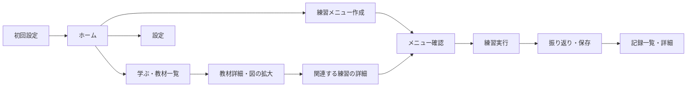

# PINGPONG 卓球上達ブラウザアプリ（PWA）要件定義書

版：1.1 / 作成・更新日：2026-10-02 / 状態：提供形態はブラウザ版に確定、その他は初版提案（実装前）

対象リポジトリ：[eternitybios-dot/PINGPONG](https://github.com/eternitybios-dot/PINGPONG)

## 1. 目的と今回の成果物

スマホのブラウザでフォームとコツを理解し、自分の環境に合う練習を続けられる卓球学習アプリを作る。中心となる体験は「イラストで学ぶ → 練習する → 記録して次の課題を決める」。読み物の閲覧だけで終わらず、教材から具体的な練習につながることを重視する。

この変更は要件定義のみ。アプリコード、イラストの完成画像、ストア申請、デプロイは成果物に含まない。

実装担当AIは以下の3文書をセットで参照する。

- 本書：対象ユーザー、機能、画面、動作、データ、品質、受入条件。
- [CONTENT_SPEC.md](CONTENT_SPEC.md)：16教材・24練習の初期カタログ、時間別メニュー、イラストの制作仕様。
- [IMPLEMENTATION_HANDOFF.md](IMPLEMENTATION_HANDOFF.md)：実装順序、納品物、引き継ぎ用プロンプト。

## 2. リポジトリの確認結果と前提

2026-10-02にGitHubを確認した。確認時のmainのコミットは `da3d653f3cb3960fa32ec03b3c222d4486c2d00f`。

| 項目 | 確認結果 |
| --- | --- |
| 既存ファイル | `README.md`のみ。本文は `# PINGPONG` |
| 既存アプリ・教材・画像 | なし |
| 技術スタック・実行方法 | 未定義 |
| リポジトリ内のAGENTS.md | なし |
| 既存コードとの互換性制約 | 現時点ではなし |

提供形態はユーザー指定によりブラウザ版に確定した。その他の項目は、指定されていない項目に対する初版の提案。明示的な変更指示があれば、その指示を優先する。

| 項目 | 初版の前提 |
| --- | --- |
| 提供形態 | スマホ優先のブラウザアプリ（PWA）。URLから利用でき、ホーム画面への追加にも対応する |
| 技術候補 | React / TypeScript / Vite。静的配信できる構成を候補とし、実装時点の安定版と採用理由を記録する |
| 言語 | 日本語 |
| 対象レベル | 初心者〜中級者。基本フォームを身につけ、ラリー・サーブ・レシーブを改善したい人 |
| グリップ | 初版はシェークハンドを対象とする。ペンホルダー専用フォームは追加リリースの対象 |
| 利き手 | 右利き・左利きの両方 |
| 利用開始 | アカウント登録なし |
| データ保存 | 使用中のブラウザ・PWAの保存領域。IndexedDBを候補とし、初版ではクラウド同期を使用しない |
| 費用・収益化 | 初版は課金・広告を組み込まない |

通常のブラウザから登録なしで使い始められる。ホーム画面への追加は任意で、追加しなくても主要機能を利用できる。初回はオンラインで読み込み、教材と画面の保存が完了してからオフライン利用が可能になる。Web App ManifestとService Workerを用意し、本番配信はHTTPSを前提とする。通知・振動・画面点灯の維持は必須にしない。

## 3. 対象ユーザーと成功の基準

想定する利用者：

- 卓球を始めた人：用語だけではフォームを想像できず、まず何を練習するか知りたい。
- 部活動・クラブで練習する人：苦手な技術を選び、限られた時間で練習したい。
- 社会人・趣味のプレーヤー：台や相手がいない日も練習を続けたい。

初版の成功基準：

1. URLを開いて登録なしで教材を読める。
2. 技術の詳細画面で、姿勢・動作の順序・打球位置・注意点を図と短い文から理解できる。
3. 所要時間・台・相手の有無を選ぶと、実行可能な練習メニューが表示される。
4. 教材から関連練習へ、練習から必要な教材へ移動できる。
5. 練習の終了後、記録と次回の課題が端末に残る。
6. 初回のオンライン読み込みとオフライン用の保存が完了した後は、通信なしでも教材・図・練習・記録の主要機能を使える。

「上達した」とアプリが自動判定することは初版の成功基準に含めない。練習時間・回数・本人が入力した達成数や振り返りを表示し、実際の技術向上とは区別する。

## 4. リリース範囲と優先度

P0：初版の受入条件。P1：初版が完成した後に追加できる改善。P2：将来の別スコープ。

| ID | 優先度 | 要件 |
| --- | --- | --- |
| R01 | P0 | 登録なしの利用開始と、利き手・レベル・練習環境・目標の設定 |
| R02 | P0 | ホームに今日の練習、前回の課題、学習再開を表示 |
| R03 | P0 | 16教材の一覧・検索・絞り込み・詳細閲覧 |
| R04 | P0 | 各教材に動作図、比較図、補助図を配置。左利き表示と拡大に対応 |
| R05 | P0 | 24練習の一覧・絞り込み・詳細と、教材との相互リンク |
| R06 | P0 | 環境と時間に合う練習メニュー、種目の入れ替え、確定前の内容確認 |
| R07 | P0 | 練習の開始・一時停止・再開・休憩・スキップ・途中終了 |
| R08 | P0 | 練習記録、任意の達成数、振り返り、履歴の編集・削除 |
| R09 | P0 | 教材・練習のお気に入り、教材の閲覧済み管理 |
| R10 | P0 | オフライン利用、ブラウザ内保存、中断した練習の復元、教材・キャッシュの更新 |
| R11 | P0 | スマホの操作性、読みやすさ、読み上げ、ホーム画面追加、ブラウザの戻る・進むへの対応 |
| R12 | P0 | 空状態、該当なし、画像欠損、保存失敗時の表示と復旧操作 |
| R13 | P1 | 手動の記録エクスポート・インポート、練習リマインダー |
| R14 | P1 | 教材に短いアニメーション・音声解説を追加 |
| R15 | P2 | 撮影動画のフォーム分析、AIコーチ、アカウントと複数端末同期 |
| R16 | P2 | ペンホルダー専用教材、試合分析、SNS、ランキング、課金 |

初版はP0を完成させる。カメラ・動画アップロード・画像認識・チャット型AIの費用や外部APIを前提にしない。

## 5. 画面構成と移動

下部ナビゲーションは「ホーム」「学ぶ」「練習」「記録」の4項目。設定はホーム右上から開く。練習の実行中は、タイマーと操作ボタンが見やすい専用画面にする。

| 画面 | 必須表示・操作 |
| --- | --- |
| 初回設定 | レベル、利き手、主な目標、普段の練習環境。スキップ可能。シェークハンド対象を明記 |
| ホーム | 「今日の練習を選ぶ」、前回のメモ、未完了練習の再開、最近見た教材、今週の実績 |
| 教材一覧 | カテゴリ、レベル、検索、お気に入り、閲覧済み状態 |
| 教材詳細 | 学べること、要点3つ以内、フォーム図、段階解説、NG/OK、セルフチェック、関連練習 |
| 図の拡大 | 全画面、ピンチ拡大、閉じる、ステップ移動、利き手の切り替え、図の説明文 |
| 練習一覧 | 目的、環境、レベル、お気に入りで絞り込み。所要時間と必要な道具をカードに表示 |
| 練習詳細 | 目的、用具、人数、場所、時間、手順、意識する点、目標、易しく／難しくする方法、関連教材 |
| メニュー作成 | 台の有無、相手の有無、使える道具、時間、目的。必要条件に合わない種目を提示しない |
| メニュー確認 | ウォームアップ・各種目・休憩・整理運動の順序と合計時間。種目入れ替え、開始 |
| 練習実行 | 種目名、残り時間、1つのコツ、小さな図、次の種目、再生／停止／スキップ／終了 |
| 振り返り | 実施した内容、実際の時間、任意の達成数、難易度、次回意識すること、保存 |
| 記録一覧・詳細 | 日付、時間、目的、実施種目、本人の振り返り。週表示、詳細、編集・削除 |
| 設定 | プロフィール変更、音、ホーム画面追加の案内、オフライン準備状況、保存先の説明、記録の全削除、アプリ・教材の版情報 |

画面のカードをタップした後に、リンク先の実データが表示されること。画面を増やすだけの空リンクや操作できないボタンを納品しない。

ブラウザの「戻る」「進む」で画面の移動ができる。教材・練習詳細のURLを直接開いたり再読み込みしたりしても、その画面を表示する。オフライン時も保存済みの画面へ移動できるよう、配信先のルーティングとService Workerの対応をそろえる。

## 6. 機能の詳細

### 6.1 初回設定・プロフィール（R01）

- レベルは「初めて」「基本を練習中」「試合で使えるようにしたい」の3段階。年齢や本名は取得しない。
- 利き手は右／左。未設定では右利きの図を表示し、図に「右利き」を明記する。
- 目標は「ラリーを安定させる」「サーブ」「回転・レシーブ」「フットワーク」「試合の組み立て」から1つ選ぶ。
- 普段の環境は「台なし・1人」「台あり・1人」「台あり・相手あり」。メニュー作成時にその日の環境を変更できる。
- スキップした場合は「基本を練習中／右／ラリーを安定させる／台なし・1人」を仮設定する。後から設定を変更できる。
- レベルは本人が変更する。閲覧や練習回数だけでレベルを自動昇格させない。

### 6.2 教材・検索（R03・R04・R09）

- 初期教材はCONTENT_SPECのT01〜T16。初版対象の全教材を閲覧可能にする。
- カテゴリは「基本」「打ち方」「回転・サーブ」「レシーブ・実戦」。教材は複数のタグを持てる。
- 検索対象はタイトル・別名・タグ・要点。全角／半角とひらがな／カタカナの差を吸収する。「つっつき」「ツッツキ」で同じ教材を見つけられる。
- 一覧のカードはタイトル・対象レベル・短い目的・サムネイルを表示する。
- 詳細の文章は1段落を短くし、フォームの説明と対応する図を近くに置く。冒頭に要点を3つ以内で示す。
- 「読んだ」を本人が記録できる。閲覧済みは習得済みを意味しない。
- 利き手の変更はフォーム・足位置・左右の文言に反映する。図中の日本語や番号は反転させない。
- 図を拡大しても、打球位置・足位置・矢印・キャプションを確認できる。

### 6.3 練習選択・メニュー（R05・R06）

- 初期練習はCONTENT_SPECのD01〜D24。各練習を単独で開始できる。
- 1人で行える種目と相手が必要な種目を明示する。台やボールが必要な種目を「台なし」に推薦しない。
- メニュー作成時にラケット・球を用意できるか確認する。台なしの素振りはラケットなしでも選べる。
- 時間は15／30／60分。台なしは15／30分を提示し、60分は台のある環境で選べる。
- 初期の7テンプレートと60分派生メニューを使い、プロフィールと選択条件から適合する候補を提示する。初版はルールベースで選び、生成AIを呼ばない。
- 目標が合う種目を優先する。レベルは初心者に中級の種目を自動推薦しないための条件とする。本人が教材一覧から中級教材を読むことは妨げない。
- 未経験者向けの台あり60分メニューは、基礎種目に置換して提示する。技術的に難しい練習を既定にしない。
- 各メニューは準備・ウォームアップ、種目、球拾い・給水を含む休憩、整理運動を表示し、合計時間を明示する。
- 種目入れ替えは同じ環境・レベルで実行できる候補のみ。候補の標準時間が違えば合計時間を再計算する。
- 合計が選択した時間を超える入れ替えは確定できない。足りない時間を無理に運動で埋めず、球拾い・休憩として明示する。
- 条件に合う候補がなければ、理由と時間・環境・目的を変更する操作を示す。空のメニューを開始させない。
- 実行中のメニューに、途中のプロフィール変更や教材更新を適用しない。開始時点の内容を保持する。

### 6.4 練習の実行と中断（R07・R10）

状態は「未開始 → 実行中 ⇄ 一時停止 → 振り返り → 保存済み」。各ステップに実施／スキップ／中断を記録する。

- 開始前に、周囲の安全と必要な道具を短く確認できる。痛みがある場合は中止できる説明を添える。
- 初期状態では音はオフ。設定でオンにし、開始などの操作でブラウザの音声再生が許可された場合に種目の終了音を鳴らす。音が再生できない場合も画面上で終了を知らせる。
- タイマーは実際に動いていた時間を数える。一時停止とアプリが前面にない時間を実施時間へ加算しない。
- 記録の「実施時間」は、準備・種目・種目内休憩・メニューの休憩・整理を含むタイマー稼働時間の合計とする。予定時間と分けて表示する。
- 画面ロック、別アプリ・別タブへの移動などでページが非表示になったら自動で一時停止する。再読み込みやブラウザの戻る操作で練習画面を離れた場合も途中状態を保持し、戻ったときに再開を選べる。ブラウザのバックグラウンド動作をタイマーの前提にしない。
- 時間の終了だけで「フォームを習得した」「目標を達成した」と扱わない。
- 種目終了時には完了を知らせ、「次へ」で進む。次の運動を無操作で開始しない。休憩も表示し、スキップできる。
- スキップした種目は実施済みにせず、計画と実績の違いを保存する。
- 途中終了時は「途中までの記録を残す」「破棄」「練習に戻る」を選べる。破棄と全削除には確認を設ける。
- 一時停止・ステップ変更・計測中の定期保存で中断状態を保存する。強制終了で失われる実施時間は最大5秒を目安とする。
- 再起動後、未完了の練習を再開／途中記録として終了／破棄できる。終了中・停止中の時間を追加しない。
- 二重タップや再起動を経ても、同じセッションを二重に保存しない。
- 同じ保存領域を共有する複数タブで、同じセッションを同時に実行・上書きしない。他のタブで実行中の場合は、その練習へ戻る案内を表示する。

### 6.5 記録・振り返り・推薦（R02・R08）

- 振り返りは「難しかった／ちょうどよい／余裕があった」と、任意の短いメモ。メモは最大300文字。
- 達成数・試行数は測定する種目だけ任意入力。空欄を0回扱いしない。達成数は試行数以下、いずれも0以上の整数とする。
- 「10球連続」と「10球中の成功数」は別の指標として保存する。アプリが成功を自動推測しない。
- ホームの今週の時間は、当週の保存済み記録の実施時間合計。予定時間や破棄した練習を足さない。
- 日付は端末のタイムゾーンを使う。週は月曜始まりとし、境界と表示ルールを統一する。
- 履歴は日付、目的、環境、種目、実施時間、本人の入力を表示する。計画時間も参照できる。
- 編集できるものは振り返り、達成数・試行数。タイマーの実測時間と開始・終了時刻は変更しない。
- お気に入りと前回の課題を次回候補に反映し、「前回の課題：サーブを短くする」など理由を短く表示する。
- 最初の記録がない場合は条件に適合した基本メニューを提示する。履歴の数字をダミーで埋めない。

### 6.6 保存・オフライン・例外（R10・R12）

- 教材の文章・イラスト・練習カタログをWebアプリの配信資産に含め、主要画面とともにオフライン用に保存する。外部画像URLの読み込みを教材の必須条件にしない。
- 初回オンライン利用時にオフライン用の保存を開始し、準備中／利用可能／失敗と再試行の状態を表示する。全教材・図・練習が保存されてから利用可能と表示する。
- オフラインで初めてアクセスする場合や保存が未完了の場合は、通信が必要な理由を表示する。教材を読み込めたかのように見せない。
- プロフィール、お気に入り、閲覧済み、記録、中断状態をブラウザ内の保存領域に保存する。教材のキャッシュとユーザーの記録を分け、教材更新で記録を消さない。
- 教材IDを変更せず、更新で履歴のリンクが壊れないようにする。廃止教材は記録のスナップショットを表示する。
- 保存失敗時には未保存であることを示し、内容を保持して再試行できる。「保存しました」を先に表示しない。
- 画像を表示できない場合は説明文と代替表示を出す。初版の完成判定では画像欠損を0件にする。
- 検索結果なし、お気に入りなし、履歴なし、適合メニューなしには、理由と次にできる操作を表示する。
- 記録を全削除しても教材は利用できる。プロフィール・お気に入りを削除する操作は別にする。
- 設定画面に「記録はこのブラウザ・PWAに保存されます」と表示する。ブラウザのサイトデータ削除や端末変更では記録を引き継げず、別ブラウザとの同期もないことを同じ画面で確認できる。
- 新しい教材・画面の版は必要な資産の保存完了後に切り替え、異なる版の本文・図が混在しないようにする。練習実行中は再読み込みを強制せず、終了後に更新を適用できる。

### 6.7 ホーム画面への追加（R11）

- アプリ名、アイコン、開始URL、表示モード、テーマ色を含むWeb App Manifestを用意する。
- AndroidのChromeとiPhoneのSafariでホーム画面への追加手順を案内する。ブラウザの自動インストール案内がない環境でも、手動の手順を確認できる。
- ホーム画面から開いたときにスマホ向けの画面を表示し、ノッチや画面下部の余白でナビゲーションが隠れないようにする。
- 通常のブラウザとホーム画面からの利用の両方で、教材・練習・記録を使える。ホーム画面への追加を利用開始の必須条件にしない。

## 7. 教材とイラストの要件

イラストは学習の主役として、フォーム・回転・打球位置・足運びを説明する。装飾用の画像だけで本文を埋めない。

| 種類 | 伝える内容 | 最低構成 |
| --- | --- | --- |
| フォーム全体図 | 構え、体の向き、足とラケットの位置 | 各教材1枠 |
| 動作の連続図 | 準備→動作→打球／重要な局面→戻り | 各教材3〜4段階を1枠にまとめる |
| NG/OK比較図 | 具体的な間違い1つと改善1つ | 各教材1組 |
| 補助図 | ラケット面・球の軌道・回転・足位置など | 各教材1枠 |
| 練習配置図 | 台、相手、立ち位置、球の行き先、移動経路 | 各練習1枠 |

16教材×4枠＋24練習×1枠＝最低88枠の学習図を用意する。枠は論理的な掲載単位であり、左右差分や連続図のコマを別に数えて水増ししない。

- 詳細な図案、色・線・視点のルール、左右対応はCONTENT_SPECの制作指示に従う。
- 基本は拡大して読みやすいSVGまたは同等の高解像度素材。図中の文字は日本語で、本文と同じ用語を使う。
- 色だけに依存せず、実線／破線、矢印、番号、OK／NGの文字を併用する。
- 人体・ラケット・球・台の位置関係と、回転の方向を確認する。実在選手の写真や既存教材を無断転載しない。
- 数値で一律にラケット角度や打球位置を固定しない。相手の回転・球の高さで変わる条件を教材内に書く。
- サーブは規則に沿う図にする。原稿にルールの参照先と確認日を残す。
- 全ての図に内容を説明する代替テキストを持たせる。重要な動きを文章でも説明する。
- イラスト制作の工程がAI生成の場合も、人物の腕・指・ラケット面、打球方向、日本語ラベルを確認してから採用する。

## 8. データの要件

以下は論理モデル。保存ライブラリの選択は実装担当に委ねる。教材・練習の原稿はコードと分けた構造化データにする。

| データ | 必須項目 |
| --- | --- |
| Profile | レベル、利き手、主目標、既定の環境、音設定、更新日時 |
| Lesson | 固定ID、タイトル、別名、カテゴリ、タグ、レベル、対象グリップ、目的、要点、動作段階、NG/OK、セルフチェック、図ID、関連練習ID、版、参照情報 |
| Illustration | 固定ID、用途、図の視点、段階番号、右用・左用の素材情報／変換規則、説明文、代替テキスト、制作・利用許諾情報 |
| Drill | 固定ID、目的、レベル、台・相手・用具条件、標準時間、手順、セット／休憩、注意点、達成指標、易しく／難しくする方法、図ID、教材ID |
| Plan | 固定ID、対象環境、利用可能な道具、対象レベル、目的、全ステップ、準備・休憩を含む合計時間 |
| Session | 一意ID、計画のスナップショット、開始・終了日時、記録時のタイムゾーン、目的・環境、実施時間、状態、各ステップの結果、振り返り |
| StepResult | 練習IDと版、開始時タイトル、計画時間、実施時間、実施／スキップ／中断、任意の達成数・試行数・指標 |
| Favorite / LearningProgress | 対象の固定ID、登録／閲覧済み日時 |
| ActiveSession | Sessionの途中状態、現在ステップ、残り時間、最後に保存した計測値、保存日時 |

内部の時間単位は秒で統一し、表示時に分・秒へ変換する。日時はタイムゾーンを復元できる形式で保存する。ブラウザ内DBにschemaVersion、教材にcontentVersionを持たせ、Webアプリ更新時に既存記録を維持する。

## 9. 使いやすさ・品質

| 項目 | 初版の条件 |
| --- | --- |
| 画面 | 縦持ちを基本に、幅320〜430 CSSピクセルで主要操作が欠けない。横持ちやPCの広い画面でも操作・閲覧を妨げない |
| 操作 | 主要タップ領域は原則48×48 CSSピクセル以上。片手で開始・停止・次へ進める |
| 文字 | 本文16px相当以上を基本に、ブラウザの文字拡大に対応。200%でも情報やボタンが消えず、ページの拡大操作を禁止しない |
| コントラスト | 通常文字4.5:1以上、大きな文字と重要な図形・操作部品3:1以上を目安に検証 |
| 読み上げ | ボタン名、状態、お気に入り、図の説明を読み上げ可能。毎秒のタイマー更新を連続して読み上げない |
| 動き | 動きを減らす設定に配慮。初版は静止画と段階送りで学習を完結できる |
| 対応ブラウザ | iPhoneのSafari、AndroidのChromeを主対象にする。実装時の最新安定版を基準とし、PCのChrome・Edge・Safariでも基本操作を可能にする。確認したOS・ブラウザの版をREADMEへ記録 |
| 性能の目安 | iPhone 12・同等のAndroid実機で、キャッシュ済みの主要画面を2秒以内、教材切り替えを1秒以内に表示。初回は下り10Mbps・往復遅延100ms程度で主要画面3秒以内を目標にし、全教材の保存進捗は別に表示 |
| 容量 | 教材イラストの圧縮後合計20MB以内を目標にする。可読性とオフライン利用を優先し、超過理由を説明できる |
| プライバシー | 初版はアカウント、カメラ、位置情報、広告ID、行動分析SDKを要求しない |
| 教材の品質 | 本文と図の整合を確認。ルールは公式資料を参照。卓球指導者によるフォーム確認を推奨 |

デザインはスポーツらしい明るさと、練習中に読める大きさを両立する。白または明るい背景を基本に、卓球台の青・緑を主色、注目点にオレンジを使う。進捗は実際の履歴から表示する。

## 10. 受入条件

各条件は実装後に確認する。本変更ではアプリを作らないため、アプリ動作のテストは対象外。

| ID | 確認内容 | 合格条件 | 対応要件 |
| --- | --- | --- | --- |
| AC01 | 初回アクセスとスキップ | URLを開き、登録・ホーム画面追加なしで教材・練習へ進め、設定を後から変更できる | R01・R11 |
| AC02 | 教材一覧・検索 | 16教材を読め、つっつき／ツッツキの両方で対象が見つかる | R03 |
| AC03 | イラスト | 88枠以上を用途ごとに配置し、図欠損・文字反転・説明との食い違いがない | R04 |
| AC04 | 左利き | 同じ教材の足・ラケット・軌道・左右文言が左用に変わり、文字と番号は読める | R01・R04 |
| AC05 | 練習カタログ | 24種目に時間・条件・手順・目標・図があり、関連教材へ移動できる | R05 |
| AC06 | 環境条件 | 台なしで相手や台が必要な種目、初心者に中級種目を自動推薦しない | R06 |
| AC07 | メニュー時間 | 7テンプレートと60分派生メニューで各ステップの合計が表示時間と一致。変更後も選択時間を超えない | R06 |
| AC08 | タイマー | 停止・別タブ・画面ロック中の時間を加算せず、復帰後は本人の操作で再開できる。複数タブで同時実行しない | R07・R10 |
| AC09 | 中断とスキップ | 中断した記録を保存でき、スキップを実施済みにせず、再起動後に復元できる | R07・R08・R10 |
| AC10 | 保存 | 二重タップでも履歴が1件。保存失敗時には内容が残り、再試行できる | R08・R12 |
| AC11 | 記録の計算 | 当週の実施時間を合算し、空欄を0扱いせず、本人入力以外の成功率を作らない | R02・R08 |
| AC12 | 永続化 | 同じブラウザ・保存領域で再読み込みや再起動をしても設定・お気に入り・閲覧済み・履歴が残る | R08・R09・R10 |
| AC13 | オフライン | HTTPSで初回読み込み・保存が完了した後、機内モードで再読み込みして教材・図・練習・タイマー・保存・履歴を使える。保存未完了と失敗を正しく表示する | R03〜R10・R12 |
| AC14 | スマホの表示 | 対象画面幅・文字200%で読め、操作でき、図を拡大できる | R11 |
| AC15 | 例外と削除 | 空状態・検索該当なし・保存失敗が理解でき、記録削除後も教材を使える | R08・R12 |
| AC16 | 更新 | Webアプリ・教材の更新後も既存履歴を読め、本文と図の版が一致する。練習中に更新のため再読み込みされない | R10 |
| AC17 | ホーム画面追加 | Android Chrome・iPhone Safariで追加手順を確認でき、追加後も主要機能を利用できる | R11 |
| AC18 | URLと画面移動 | 教材・練習詳細の直接アクセス、再読み込み、戻る・進むが動作する。オフライン準備後も保存済みの画面へ移動できる | R10・R11 |

初版完了の判定はP0とAC01〜AC18。P1・P2の追加をP0の未完成の理由にしない。

## 11. 実装前に伝える事項

- 提供形態はユーザーの希望によりブラウザ版（PWA）で確定している。URLから利用できるスマホ優先のWebアプリを実装する。
- シェークハンド・初心者〜中級者を初版の対象にする。この前提を変える場合は教材の図案・対応数も更新する。
- 実装担当はローカル起動・本番用ビルド・HTTPS配信に必要な設定と手順を用意する。公開先と本番URLの決定・公開作業は配信工程で行う。
- CONTENT_SPECの文章は教材の原稿案。実装時には各教材の全段階、説明文、セルフチェックと図を仕上げる。タイトルだけの教材やプレースホルダー画像で受入完了にしない。
- 著作権・技術ルールの確認結果は教材の参照情報に残す。アプリの利用者に内部の制作手順を表示する必要はない。
